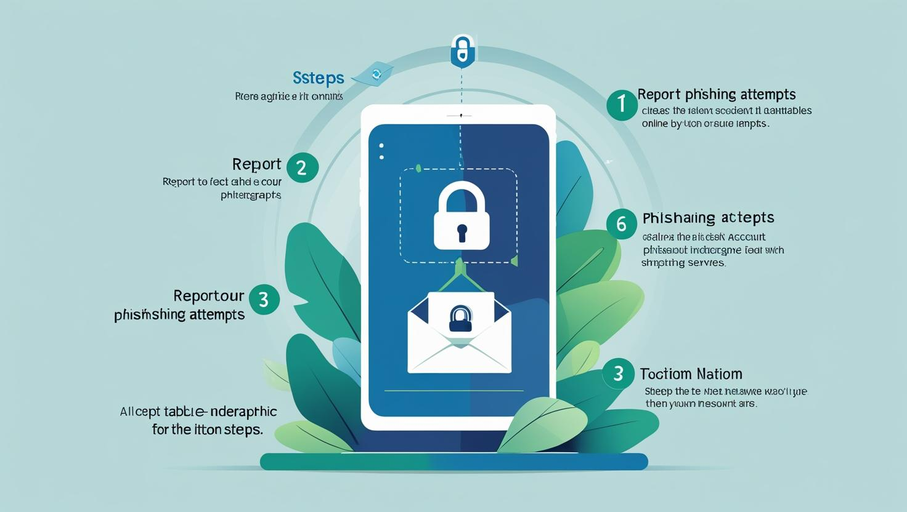
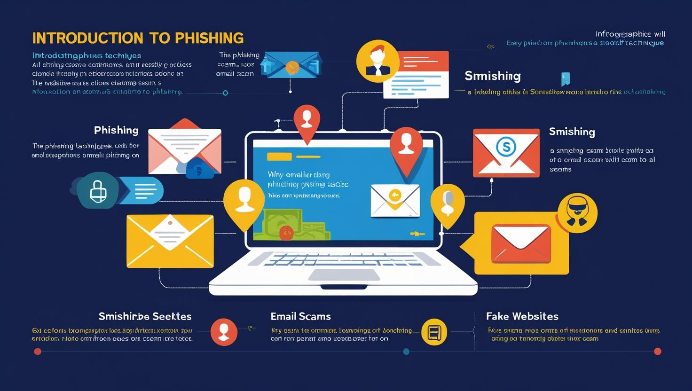
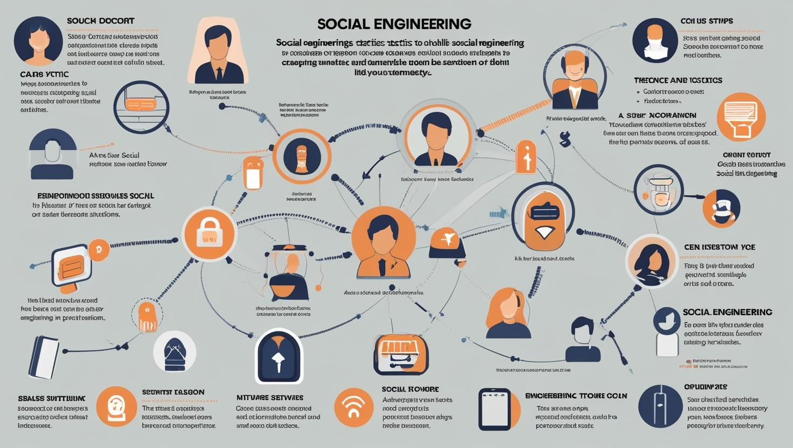
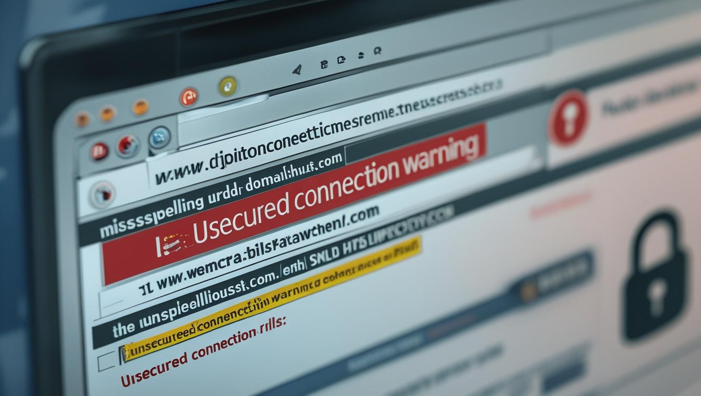

# Phishing Awareness Training

This repository contains resources for phishing awareness training. Below are the visual guides to help you understand and combat phishing attacks.

## Best Practices to Stay Safe from Phishing

## How to Report Phishing

## Introduction to Phishing

## Recognizing Phishing Emails

## Social Engineering Tactics

## Spotting Fake Websites
